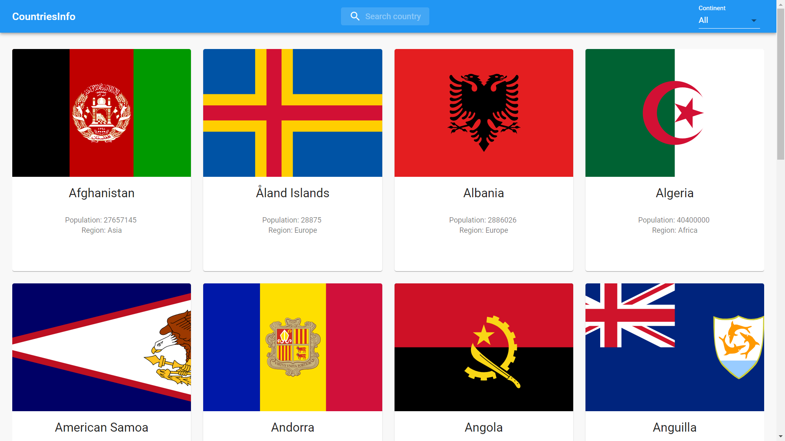
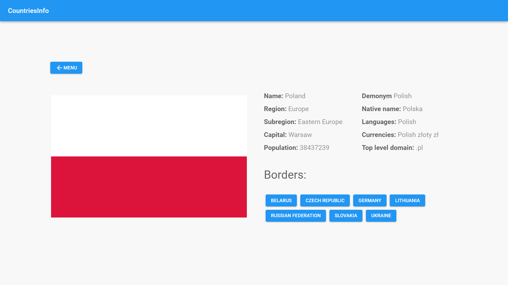

# Countries Info app

Project made with Next js, Typescript and Material Ui for self learning.
Using this application you can get basic information about countries

## Demo

https://countries-info-nu.vercel.app/

## Technologies

- React 16.13.1
- React Hooks
- Next 9.5.2
- TypeScript 4.0.2
- Material Ui
- React Infinite Scroll Component

## Features

- Get basic information about countries
- Get detailed information about countries in another site
- Filter countries by their name and region

## Screenshots

## Inspiration

Front-end design inspired by Mateusz Pocztowski https://github.com/mateusz-pocztowski/Where-in-the-world
